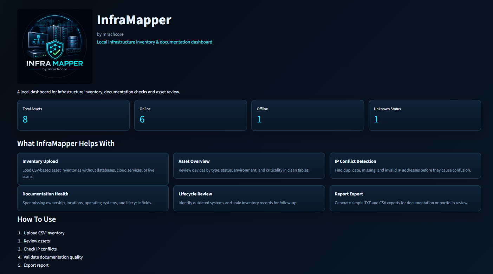
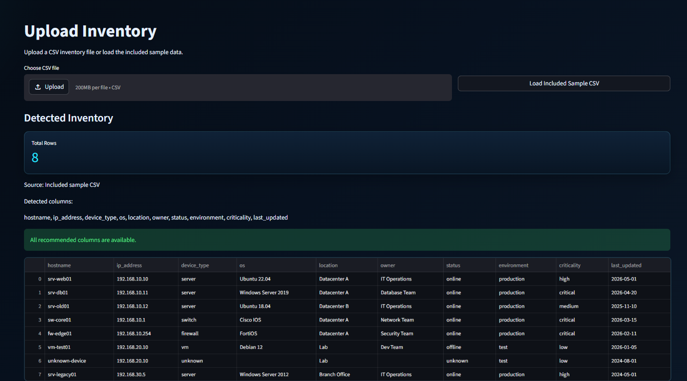
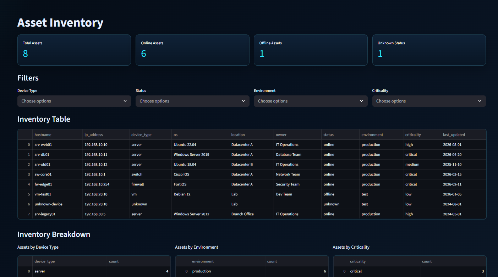
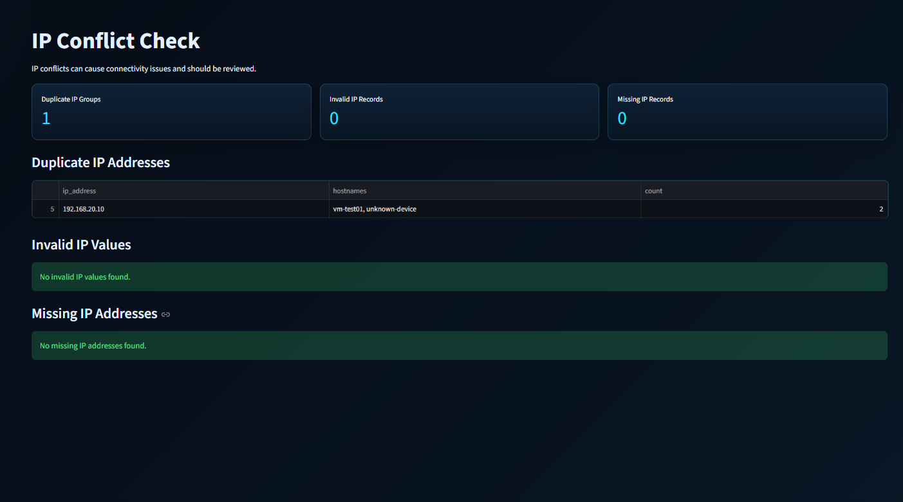
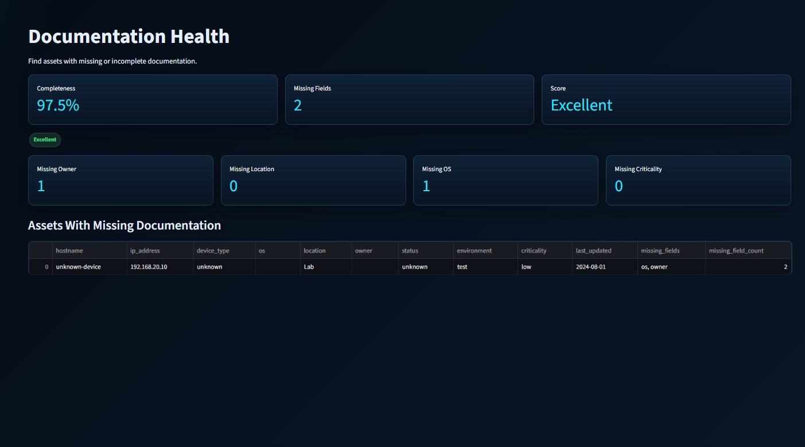
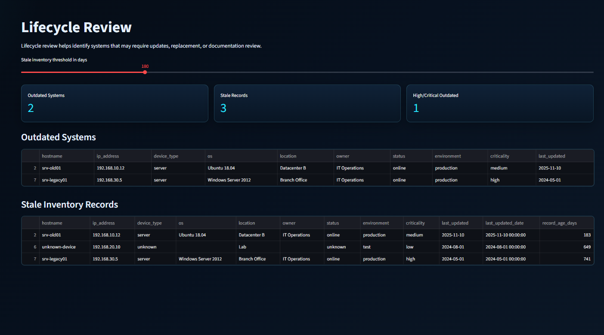
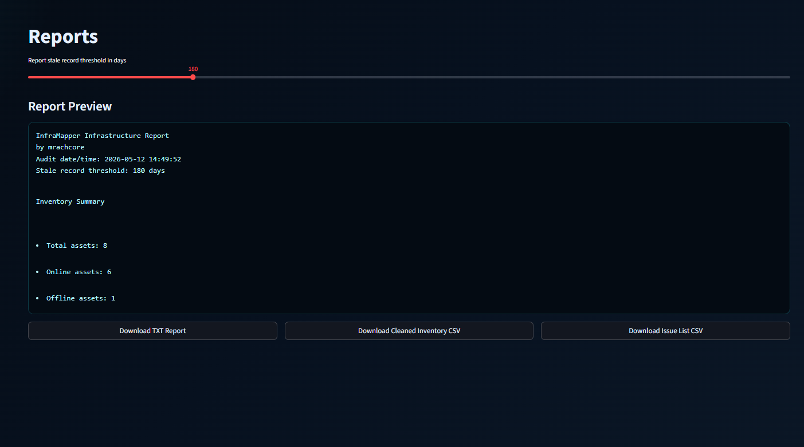

# InfraMapper

<p align="center">
  
</p>

**Local infrastructure inventory and documentation dashboard built with Python and Streamlit.**

InfraMapper is a beginner-friendly but professional portfolio project by **mrachcore**. It helps junior sysadmins document infrastructure assets, review inventory quality, detect IP conflicts, identify outdated systems, and generate simple local reports from CSV files.

> This project is fully local. It does not use paid APIs, cloud services, databases, Docker, AI APIs, external services, production integrations, or live network scanning.

## Overview

InfraMapper works like a lightweight local CMDB-style dashboard. Upload an infrastructure CSV file, review the asset inventory, check for documentation gaps, inspect lifecycle risks, and export reports for documentation or learning purposes.

The project was created as part of a learning path during an Ausbildung as **Fachinformatiker für Systemintegration**.

## Features

- CSV inventory upload and preview
- Included sample inventory file
- Automatic column normalization for names like `HostName` or `IP_ADDRESS`
- Asset inventory table with filters
- Metrics for total, online, offline, and unknown-status assets
- Asset breakdowns by device type, environment, status, and criticality
- Duplicate IP detection
- Missing and invalid IP checks using Python's `ipaddress` module
- Documentation health score and completeness percentage
- Missing owner, location, OS, and criticality checks
- Outdated operating system review
- Stale inventory review based on configurable age threshold
- Downloadable text infrastructure report
- Downloadable cleaned inventory CSV
- Downloadable issue list CSV
- Dark professional internal IT dashboard design

## Tech Stack

| Technology | Purpose |
| --- | --- |
| Python 3 | Main programming language |
| Streamlit | Local web dashboard |
| pandas | CSV analysis and table handling |
| ipaddress | IP address validation |
| datetime | Date and stale-record checks |
| io | CSV export handling |

## Installation

Clone or download this project, then open a terminal inside the project folder.

```bash
cd infra-mapper
```

Create a virtual environment:

```bash
python -m venv .venv
```

Activate it on Windows:

```bash
.venv\Scripts\activate
```

Activate it on macOS or Linux:

```bash
source .venv/bin/activate
```

Install the required packages:

```bash
pip install -r requirements.txt
```

## Run The App

```bash
streamlit run app.py
```

Streamlit will show a local URL, usually:

```text
http://localhost:8501
```

Open that URL in your browser and use the sidebar navigation.

## Project Structure

```text
infra-mapper/
  app.py
  requirements.txt
  README.md
  sample_data/
    infrastructure_sample.csv
  assets/
    logo.png
  screenshots/
    dashboard.png
    upload-inventory.png
    asset-inventory.png
    ip-conflict-check.png
    documentation-health.png
    lifecycle-review.png
    reports.png
  utils/
    inventory_tools.py
    validation_tools.py
    report_generator.py
```

## Screenshots

Add screenshots after running the app locally:









## Sample CSV

The included sample file is located at:

```text
sample_data/infrastructure_sample.csv
```

Recommended columns:

```text
hostname, ip_address, device_type, os, location, owner, status, environment, criticality, last_updated
```

InfraMapper handles missing optional columns gracefully by adding empty columns internally. This allows the dashboard to keep working even if an uploaded CSV is incomplete.

## Notes

- Best results come from clean CSV files with one row per asset.
- Dates in `last_updated` should use a clear format such as `YYYY-MM-DD`.
- This tool validates documented inventory data only.
- It does not perform network discovery or production checks.

## Future Improvements

- Add more lifecycle rules for common operating systems
- Add CSV templates for different infrastructure environments
- Add subnet grouping based on documented IP addresses
- Add chart visualizations for asset trends
- Add optional JSON report export
- Add more documentation quality recommendations

## Disclaimer

This tool does not scan networks or connect to production systems. It only analyzes uploaded CSV inventory files locally.

## Author

**mrachcore**

GitHub placeholder: <https://github.com/mrachcore/infra-mapper>

## Suggested GitHub Topics

```text
python
streamlit
infrastructure
inventory
asset-management
cmdb
sysadmin
dashboard
csv-analysis
documentation
portfolio-project
fachinformatiker
```
